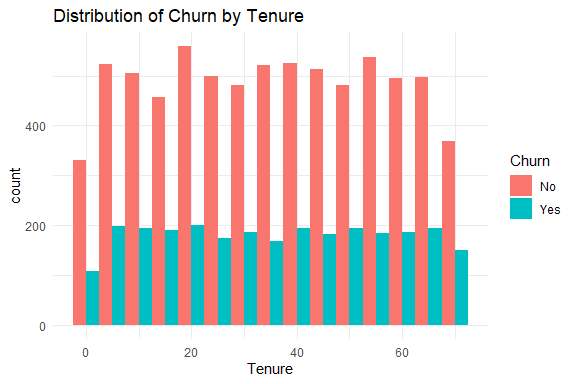
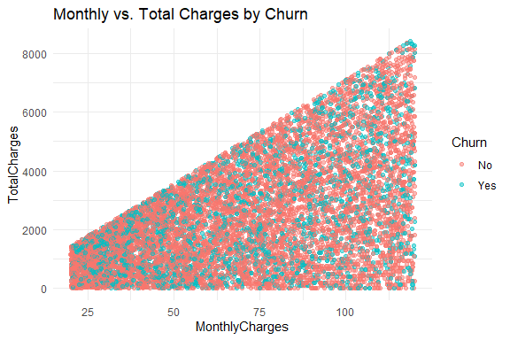
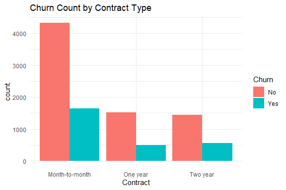
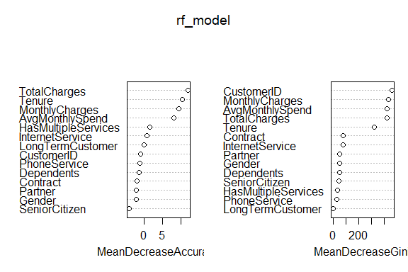
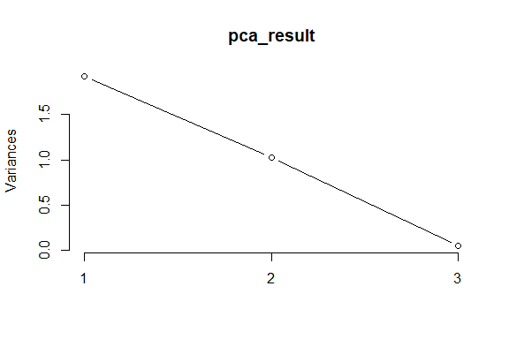

SA1_DATA MINING & DATA WRANGLING
================
QUINTERO
2025-03-20

### Setup and Load Libraries

``` r
library(tidyverse)  # For data manipulation and visualization
```

    ## ── Attaching core tidyverse packages ──────────────────────── tidyverse 2.0.0 ──
    ## ✔ dplyr     1.1.4     ✔ readr     2.1.5
    ## ✔ forcats   1.0.0     ✔ stringr   1.5.1
    ## ✔ ggplot2   3.5.1     ✔ tibble    3.2.1
    ## ✔ lubridate 1.9.4     ✔ tidyr     1.3.1
    ## ✔ purrr     1.0.2     
    ## ── Conflicts ────────────────────────────────────────── tidyverse_conflicts() ──
    ## ✖ dplyr::filter() masks stats::filter()
    ## ✖ dplyr::lag()    masks stats::lag()
    ## ℹ Use the conflicted package (<http://conflicted.r-lib.org/>) to force all conflicts to become errors

``` r
library(caret)      # For machine learning
```

    ## Warning: package 'caret' was built under R version 4.4.3

    ## Loading required package: lattice
    ## 
    ## Attaching package: 'caret'
    ## 
    ## The following object is masked from 'package:purrr':
    ## 
    ##     lift

``` r
library(glmnet)     # For ridge and lasso regression
```

    ## Warning: package 'glmnet' was built under R version 4.4.3

    ## Loading required package: Matrix
    ## 
    ## Attaching package: 'Matrix'
    ## 
    ## The following objects are masked from 'package:tidyr':
    ## 
    ##     expand, pack, unpack
    ## 
    ## Loaded glmnet 4.1-8

``` r
library(ggplot2)    # For data visualization
library(rpart)      # For decision tree modeling
library(randomForest)  # For Random Forest classifier
```

    ## Warning: package 'randomForest' was built under R version 4.4.3

    ## randomForest 4.7-1.2
    ## Type rfNews() to see new features/changes/bug fixes.
    ## 
    ## Attaching package: 'randomForest'
    ## 
    ## The following object is masked from 'package:dplyr':
    ## 
    ##     combine
    ## 
    ## The following object is masked from 'package:ggplot2':
    ## 
    ##     margin

``` r
library(e1071)      # For SVM and other ML models
```

    ## Warning: package 'e1071' was built under R version 4.4.3

``` r
library(gridExtra)  # For arranging multiple plots
```

    ## Warning: package 'gridExtra' was built under R version 4.4.3

    ## 
    ## Attaching package: 'gridExtra'
    ## 
    ## The following object is masked from 'package:randomForest':
    ## 
    ##     combine
    ## 
    ## The following object is masked from 'package:dplyr':
    ## 
    ##     combine

``` r
library(pROC)       # For ROC curves
```

    ## Warning: package 'pROC' was built under R version 4.4.3

    ## Type 'citation("pROC")' for a citation.
    ## 
    ## Attaching package: 'pROC'
    ## 
    ## The following objects are masked from 'package:stats':
    ## 
    ##     cov, smooth, var

``` r
library(psych)      # For PCA
```

    ## Warning: package 'psych' was built under R version 4.4.3

    ## 
    ## Attaching package: 'psych'
    ## 
    ## The following object is masked from 'package:randomForest':
    ## 
    ##     outlier
    ## 
    ## The following objects are masked from 'package:ggplot2':
    ## 
    ##     %+%, alpha

## UNIT 1: R for Data Mining

### Intro to Modern Data Mining

##### Load the dataset and provide an overview of its structure (e.g., dimensions, missing values, types of variables).

``` r
data <- read.csv("C:/Users/sbcvj/Downloads/customer_churn.csv")
head(data)
```

    ##   CustomerID Gender SeniorCitizen Partner Dependents Tenure PhoneService
    ## 1  CUST00001   Male             0      No         No     65          Yes
    ## 2  CUST00002   Male             0      No         No     26          Yes
    ## 3  CUST00003   Male             0     Yes         No     54          Yes
    ## 4  CUST00004 Female             0     Yes        Yes     70          Yes
    ## 5  CUST00005   Male             0      No         No     53          Yes
    ## 6  CUST00006 Female             0      No        Yes     45          Yes
    ##   InternetService       Contract MonthlyCharges TotalCharges Churn
    ## 1     Fiber optic Month-to-month          20.04      1302.60    No
    ## 2     Fiber optic Month-to-month          65.14      1693.64    No
    ## 3     Fiber optic Month-to-month          49.38      2666.52    No
    ## 4             DSL       One year          31.19      2183.30    No
    ## 5             DSL Month-to-month         103.86      5504.58   Yes
    ## 6     Fiber optic Month-to-month          87.34      3930.30   Yes

``` r
str(data) # structure
```

    ## 'data.frame':    10000 obs. of  12 variables:
    ##  $ CustomerID     : chr  "CUST00001" "CUST00002" "CUST00003" "CUST00004" ...
    ##  $ Gender         : chr  "Male" "Male" "Male" "Female" ...
    ##  $ SeniorCitizen  : int  0 0 0 0 0 0 0 0 0 0 ...
    ##  $ Partner        : chr  "No" "No" "Yes" "Yes" ...
    ##  $ Dependents     : chr  "No" "No" "No" "Yes" ...
    ##  $ Tenure         : int  65 26 54 70 53 45 35 20 48 33 ...
    ##  $ PhoneService   : chr  "Yes" "Yes" "Yes" "Yes" ...
    ##  $ InternetService: chr  "Fiber optic" "Fiber optic" "Fiber optic" "DSL" ...
    ##  $ Contract       : chr  "Month-to-month" "Month-to-month" "Month-to-month" "One year" ...
    ##  $ MonthlyCharges : num  20 65.1 49.4 31.2 103.9 ...
    ##  $ TotalCharges   : num  1303 1694 2667 2183 5505 ...
    ##  $ Churn          : chr  "No" "No" "No" "No" ...

``` r
sum(is.na(data)) # checking the missing values
```

    ## [1] 0

``` r
dim(data) # dimensions
```

    ## [1] 10000    12

``` r
summary(data) #summary
```

    ##   CustomerID           Gender          SeniorCitizen      Partner         
    ##  Length:10000       Length:10000       Min.   :0.0000   Length:10000      
    ##  Class :character   Class :character   1st Qu.:0.0000   Class :character  
    ##  Mode  :character   Mode  :character   Median :0.0000   Mode  :character  
    ##                                        Mean   :0.1502                     
    ##                                        3rd Qu.:0.0000                     
    ##                                        Max.   :1.0000                     
    ##   Dependents            Tenure      PhoneService       InternetService   
    ##  Length:10000       Min.   : 0.00   Length:10000       Length:10000      
    ##  Class :character   1st Qu.:17.00   Class :character   Class :character  
    ##  Mode  :character   Median :35.00   Mode  :character   Mode  :character  
    ##                     Mean   :35.22                                        
    ##                     3rd Qu.:53.00                                        
    ##                     Max.   :71.00                                        
    ##    Contract         MonthlyCharges    TotalCharges       Churn          
    ##  Length:10000       Min.   : 20.02   Min.   :   0.0   Length:10000      
    ##  Class :character   1st Qu.: 44.88   1st Qu.: 961.2   Class :character  
    ##  Mode  :character   Median : 70.56   Median :2025.6   Mode  :character  
    ##                     Mean   : 70.18   Mean   :2455.8                     
    ##                     3rd Qu.: 95.77   3rd Qu.:3611.0                     
    ##                     Max.   :119.99   Max.   :8425.6

### Explain why data mining is important for this dataset.

##### Data mining is important in this dataset prediction especially for taking proactive measures and helps businesses to maintain their customers by identifying what we called at-risk customers.

### Data Visualization

``` r
ggplot(data, aes(x = Tenure, fill = Churn)) + 
  geom_histogram(binwidth = 5, position = "dodge") + 
  theme_minimal() + 
  ggtitle("Distribution of Churn by Tenure")
```

<!-- -->

##### This plot illustrates how churn varies by customer tenure.

``` r
ggplot(data, aes(x = MonthlyCharges, y = TotalCharges, color = Churn)) + 
  geom_point(alpha = 0.5) + 
  theme_minimal() + 
  ggtitle("Monthly vs. Total Charges by Churn")
```

<!-- -->

##### This second plot, visualizes the relationship between MonthlyCharges and TotalCharges. We can see in the plot, that customers with lower MonthlyCharges have low TotalCharges, and customers who have higher MonthlyCharges and TotalCharges are most likely to churn or leave.

``` r
ggplot(data, aes(x = Contract, fill = Churn)) + 
  geom_bar(position = "dodge") +  
  theme_minimal() + 
  ggtitle("Churn Count by Contract Type")
```

<!-- -->

##### In this plot, we can see that there are more customers in month-to-month contract, than having a contract with one year and two year. We can also see that there are more customers who are not leaving in the month-to-month contract. However, month-to-month contract has also the biggest count when it comes to customers leaving. Having said, one year and two year contract has almost the same count when it comes to churn.

### Data Transformation

### Handle missing values appropriately

``` r
data <- na.omit(data)
```

### Convert categorical variables into factor variables.

``` r
data$Churn <- as.factor(data$Churn)
data$Contract <- as.factor(data$Contract)
```

### Normalize or standardize numerical features where necessary.

``` r
data <- data %>% mutate(across(where(is.numeric), scale))
```

### 4. Data Wrangling

### Filter data to remove outliers

``` r
library(dplyr)

quantiles <- quantile(data$MonthlyCharges, probs = c(0.01, 0.99), na.rm = TRUE)

data <- data %>% 
  filter(MonthlyCharges > quantiles[[1]] & MonthlyCharges < quantiles[[2]])
```

    ## Warning: Using one column matrices in `filter()` was deprecated in dplyr 1.1.0.
    ## ℹ Please use one dimensional logical vectors instead.
    ## This warning is displayed once every 8 hours.
    ## Call `lifecycle::last_lifecycle_warnings()` to see where this warning was
    ## generated.

### Create new derived variables that may help in predictive modeling.

``` r
data <- data %>%
  mutate(
    AvgMonthlySpend = TotalCharges / Tenure,  # Average monthly spend per customer
    HasMultipleServices = ifelse(InternetService != "No" & PhoneService == "Yes", 1, 0),  # Flag for multiple services
    LongTermCustomer = ifelse(Tenure > 24, 1, 0)  # Customers who stayed longer than 2 years
  )
```

### Aggregate or summarize data if necessary

``` r
data %>%
  group_by(Contract) %>%
  summarise(
    AvgMonthlyCharges = mean(MonthlyCharges, na.rm = TRUE),
    ChurnRate = mean(as.numeric(Churn == "Yes"), na.rm = TRUE),
    Count = n()
  )
```

    ## # A tibble: 3 × 4
    ##   Contract       AvgMonthlyCharges ChurnRate Count
    ##   <fct>                      <dbl>     <dbl> <int>
    ## 1 Month-to-month            0.0117     0.276  5843
    ## 2 One year                 -0.0194     0.246  1976
    ## 3 Two year                 -0.0142     0.280  1981

### Review

### Summarize key takeaways from the exploratory data analysis process

##### Loading the dataset gives us 10,000 rows and gives us some variables. We can also see, in the plot that the count between the churn and no churn is imbalanced meaning we need to double check if the rows are having missing variables. To do this, we need to do data transformation and wrangling, as we remove some missing values and outliers. And by doing these steps, it gave us a result of having total of 9727 rows as of now.

### Unit 2: Tuning Predictive Models

``` r
data$Churn <- factor(data$Churn, levels = c("No", "Yes"))

set.seed(42)
train_index <- createDataPartition(data$Churn, p = 0.8, list = FALSE)
train_data <- data[train_index, ]
test_data <- data[-train_index, ]

train_data$Churn <- factor(train_data$Churn, levels = c("No", "Yes"))
test_data$Churn <- factor(test_data$Churn, levels = c("No", "Yes"))

train_data$TotalCharges[is.na(train_data$TotalCharges)] <- median(train_data$TotalCharges, na.rm = TRUE)
```

``` r
log_model_churn <- glm(Churn ~ Tenure + MonthlyCharges + TotalCharges + Gender + Partner + Dependents + PhoneService + InternetService + Contract, data = train_data, family = binomial)

summary(log_model_churn)
```

    ## 
    ## Call:
    ## glm(formula = Churn ~ Tenure + MonthlyCharges + TotalCharges + 
    ##     Gender + Partner + Dependents + PhoneService + InternetService + 
    ##     Contract, family = binomial, data = train_data)
    ## 
    ## Coefficients:
    ##                            Estimate Std. Error z value Pr(>|z|)    
    ## (Intercept)                -0.79399    0.09766  -8.131 4.27e-16 ***
    ## Tenure                      0.06625    0.06716   0.986   0.3239    
    ## MonthlyCharges              0.01253    0.05178   0.242   0.8087    
    ## TotalCharges               -0.06849    0.08007  -0.855   0.3924    
    ## GenderMale                 -0.06462    0.05095  -1.268   0.2047    
    ## PartnerYes                 -0.07016    0.05094  -1.377   0.1684    
    ## DependentsYes              -0.07530    0.05600  -1.345   0.1787    
    ## PhoneServiceYes            -0.10441    0.08503  -1.228   0.2195    
    ## InternetServiceFiber optic  0.02586    0.05668   0.456   0.6481    
    ## InternetServiceNo          -0.03589    0.07068  -0.508   0.6116    
    ## ContractOne year           -0.14791    0.06736  -2.196   0.0281 *  
    ## ContractTwo year            0.05601    0.06435   0.870   0.3841    
    ## ---
    ## Signif. codes:  0 '***' 0.001 '**' 0.01 '*' 0.05 '.' 0.1 ' ' 1
    ## 
    ## (Dispersion parameter for binomial family taken to be 1)
    ## 
    ##     Null deviance: 9160.4  on 7840  degrees of freedom
    ## Residual deviance: 9144.2  on 7829  degrees of freedom
    ## AIC: 9168.2
    ## 
    ## Number of Fisher Scoring iterations: 4

``` r
train_data$TotalCharges[is.na(train_data$TotalCharges)] <- median(train_data$TotalCharges, na.rm = TRUE)

decision_tree_churn <- rpart(Churn ~ Tenure + MonthlyCharges + TotalCharges + Gender + Partner + Dependents + PhoneService + InternetService + Contract, data = train_data, method = "class", control = rpart.control(cp = 0, maxdepth = 5))

summary(decision_tree_churn)
```

    ## Call:
    ## rpart(formula = Churn ~ Tenure + MonthlyCharges + TotalCharges + 
    ##     Gender + Partner + Dependents + PhoneService + InternetService + 
    ##     Contract, data = train_data, method = "class", control = rpart.control(cp = 0, 
    ##     maxdepth = 5))
    ##   n= 7841 
    ## 
    ##             CP nsplit rel error   xerror       xstd
    ## 1 0.0005649718      0 1.0000000 1.000000 0.01852768
    ## 2 0.0001569366      7 0.9957627 1.010358 0.01858752
    ## 3 0.0000000000     10 0.9952919 1.011770 0.01859561
    ## 
    ## Variable importance
    ##  MonthlyCharges          Tenure    TotalCharges        Contract InternetService 
    ##              37              27              25               9               2 
    ##         Partner 
    ##               2 
    ## 
    ## Node number 1: 7841 observations,    complexity param=0.0005649718
    ##   predicted class=No   expected loss=0.2708838  P(node) =1
    ##     class counts:  5717  2124
    ##    probabilities: 0.729 0.271 
    ##   left son=2 (1561 obs) right son=3 (6280 obs)
    ##   Primary splits:
    ##       Contract       splits as  RLR, improve=2.2917240, (0 missing)
    ##       TotalCharges   < -1.29926   to the left,  improve=2.2787810, (0 missing)
    ##       Tenure         < 1.649062   to the left,  improve=2.1383750, (0 missing)
    ##       MonthlyCharges < 1.310666   to the right, improve=2.0873770, (0 missing)
    ##       Partner        splits as  RL, improve=0.8112074, (0 missing)
    ## 
    ## Node number 2: 1561 observations
    ##   predicted class=No   expected loss=0.2466368  P(node) =0.1990817
    ##     class counts:  1176   385
    ##    probabilities: 0.753 0.247 
    ## 
    ## Node number 3: 6280 observations,    complexity param=0.0005649718
    ##   predicted class=No   expected loss=0.2769108  P(node) =0.8009183
    ##     class counts:  4541  1739
    ##    probabilities: 0.723 0.277 
    ##   left son=6 (710 obs) right son=7 (5570 obs)
    ##   Primary splits:
    ##       MonthlyCharges < 1.310666   to the right, improve=1.9230140, (0 missing)
    ##       TotalCharges   < 2.581088   to the right, improve=1.7775230, (0 missing)
    ##       Tenure         < 1.649062   to the left,  improve=1.0904630, (0 missing)
    ##       Gender         splits as  RL, improve=0.9785250, (0 missing)
    ##       PhoneService   splits as  RL, improve=0.5304384, (0 missing)
    ##   Surrogate splits:
    ##       TotalCharges < 2.526679   to the right, agree=0.898, adj=0.099, (0 split)
    ## 
    ## Node number 6: 710 observations,    complexity param=0.0001569366
    ##   predicted class=No   expected loss=0.2422535  P(node) =0.09054967
    ##     class counts:   538   172
    ##    probabilities: 0.758 0.242 
    ##   left son=12 (17 obs) right son=13 (693 obs)
    ##   Primary splits:
    ##       MonthlyCharges < 1.323412   to the left,  improve=2.0442980, (0 missing)
    ##       TotalCharges   < 2.625601   to the right, improve=1.4530050, (0 missing)
    ##       Contract       splits as  L-R, improve=0.8089448, (0 missing)
    ##       Partner        splits as  RL, improve=0.6781195, (0 missing)
    ##       PhoneService   splits as  RL, improve=0.6395292, (0 missing)
    ## 
    ## Node number 7: 5570 observations,    complexity param=0.0005649718
    ##   predicted class=No   expected loss=0.2813285  P(node) =0.7103686
    ##     class counts:  4003  1567
    ##    probabilities: 0.719 0.281 
    ##   left son=14 (5359 obs) right son=15 (211 obs)
    ##   Primary splits:
    ##       MonthlyCharges < 1.212139   to the left,  improve=2.1114560, (0 missing)
    ##       TotalCharges   < 1.814975   to the left,  improve=1.4766800, (0 missing)
    ##       Tenure         < 1.649062   to the left,  improve=1.0706790, (0 missing)
    ##       Gender         splits as  RL, improve=0.8842221, (0 missing)
    ##       Dependents     splits as  RL, improve=0.3124520, (0 missing)
    ##   Surrogate splits:
    ##       TotalCharges < 2.541483   to the left,  agree=0.963, adj=0.014, (0 split)
    ## 
    ## Node number 12: 17 observations
    ##   predicted class=No   expected loss=0  P(node) =0.002168091
    ##     class counts:    17     0
    ##    probabilities: 1.000 0.000 
    ## 
    ## Node number 13: 693 observations,    complexity param=0.0001569366
    ##   predicted class=No   expected loss=0.2481962  P(node) =0.08838158
    ##     class counts:   521   172
    ##    probabilities: 0.752 0.248 
    ##   left son=26 (62 obs) right son=27 (631 obs)
    ##   Primary splits:
    ##       TotalCharges   < 2.625601   to the right, improve=1.4457550, (0 missing)
    ##       MonthlyCharges < 1.341154   to the right, improve=1.4452270, (0 missing)
    ##       Contract       splits as  L-R, improve=0.7489437, (0 missing)
    ##       PhoneService   splits as  RL, improve=0.6159093, (0 missing)
    ##       Tenure         < 0.4463994  to the right, improve=0.5604130, (0 missing)
    ##   Surrogate splits:
    ##       Tenure < 1.360423   to the right, agree=0.974, adj=0.71, (0 split)
    ## 
    ## Node number 14: 5359 observations,    complexity param=0.0005649718
    ##   predicted class=No   expected loss=0.2785968  P(node) =0.6834587
    ##     class counts:  3866  1493
    ##    probabilities: 0.721 0.279 
    ##   left son=28 (5336 obs) right son=29 (23 obs)
    ##   Primary splits:
    ##       MonthlyCharges < -1.68441   to the right, improve=1.1269620, (0 missing)
    ##       TotalCharges   < -0.7240061 to the right, improve=1.1120670, (0 missing)
    ##       Tenure         < 1.649062   to the left,  improve=0.9737756, (0 missing)
    ##       Gender         splits as  RL, improve=0.6594464, (0 missing)
    ##       Dependents     splits as  RL, improve=0.3792177, (0 missing)
    ## 
    ## Node number 15: 211 observations,    complexity param=0.0005649718
    ##   predicted class=No   expected loss=0.3507109  P(node) =0.02690983
    ##     class counts:   137    74
    ##    probabilities: 0.649 0.351 
    ##   left son=30 (168 obs) right son=31 (43 obs)
    ##   Primary splits:
    ##       TotalCharges    < 1.784157   to the left,  improve=2.0468910, (0 missing)
    ##       Tenure          < 0.8793578  to the left,  improve=1.7809600, (0 missing)
    ##       InternetService splits as  LRR, improve=1.6832690, (0 missing)
    ##       MonthlyCharges  < 1.230225   to the right, improve=1.1649100, (0 missing)
    ##       Gender          splits as  RL, improve=0.6970595, (0 missing)
    ##   Surrogate splits:
    ##       Tenure         < 0.8793578  to the left,  agree=0.995, adj=0.977, (0 split)
    ##       MonthlyCharges < 1.308943   to the left,  agree=0.801, adj=0.023, (0 split)
    ## 
    ## Node number 26: 62 observations
    ##   predicted class=No   expected loss=0.1451613  P(node) =0.007907155
    ##     class counts:    53     9
    ##    probabilities: 0.855 0.145 
    ## 
    ## Node number 27: 631 observations,    complexity param=0.0001569366
    ##   predicted class=No   expected loss=0.2583201  P(node) =0.08047443
    ##     class counts:   468   163
    ##    probabilities: 0.742 0.258 
    ##   left son=54 (620 obs) right son=55 (11 obs)
    ##   Primary splits:
    ##       Tenure         < 1.408529   to the left,  improve=1.8459960, (0 missing)
    ##       TotalCharges   < 2.54433    to the left,  improve=1.3339590, (0 missing)
    ##       Contract       splits as  L-R, improve=1.2400140, (0 missing)
    ##       MonthlyCharges < 1.665672   to the left,  improve=1.0541020, (0 missing)
    ##       PhoneService   splits as  RL, improve=0.7051764, (0 missing)
    ##   Surrogate splits:
    ##       TotalCharges < 2.54433    to the left,  agree=0.987, adj=0.273, (0 split)
    ## 
    ## Node number 28: 5336 observations
    ##   predicted class=No   expected loss=0.2779235  P(node) =0.6805254
    ##     class counts:  3853  1483
    ##    probabilities: 0.722 0.278 
    ## 
    ## Node number 29: 23 observations,    complexity param=0.0005649718
    ##   predicted class=No   expected loss=0.4347826  P(node) =0.002933299
    ##     class counts:    13    10
    ##    probabilities: 0.565 0.435 
    ##   left son=58 (8 obs) right son=59 (15 obs)
    ##   Primary splits:
    ##       MonthlyCharges  < -1.692334  to the left,  improve=2.3543480, (0 missing)
    ##       InternetService splits as  RLR, improve=1.9505020, (0 missing)
    ##       Tenure          < -0.9486889 to the left,  improve=1.7150620, (0 missing)
    ##       TotalCharges    < -1.148383  to the left,  improve=1.7150620, (0 missing)
    ##       Partner         splits as  LR, improve=0.1043478, (0 missing)
    ##   Surrogate splits:
    ##       Tenure       < -0.9486889 to the left,  agree=0.696, adj=0.125, (0 split)
    ##       TotalCharges < -1.148383  to the left,  agree=0.696, adj=0.125, (0 split)
    ##       Partner      splits as  LR, agree=0.696, adj=0.125, (0 split)
    ## 
    ## Node number 30: 168 observations
    ##   predicted class=No   expected loss=0.3154762  P(node) =0.02142584
    ##     class counts:   115    53
    ##    probabilities: 0.685 0.315 
    ## 
    ## Node number 31: 43 observations,    complexity param=0.0005649718
    ##   predicted class=No   expected loss=0.4883721  P(node) =0.005483994
    ##     class counts:    22    21
    ##    probabilities: 0.512 0.488 
    ##   left son=62 (19 obs) right son=63 (24 obs)
    ##   Primary splits:
    ##       TotalCharges    < 2.311945   to the right, improve=2.0278460, (0 missing)
    ##       Tenure          < 1.456636   to the right, improve=1.8915980, (0 missing)
    ##       Contract        splits as  L-R, improve=0.6474630, (0 missing)
    ##       InternetService splits as  LRR, improve=0.6128165, (0 missing)
    ##       MonthlyCharges  < 1.237632   to the right, improve=0.3669435, (0 missing)
    ##   Surrogate splits:
    ##       Tenure          < 1.312316   to the right, agree=0.977, adj=0.947, (0 split)
    ##       InternetService splits as  LRR, agree=0.651, adj=0.211, (0 split)
    ##       MonthlyCharges  < 1.275182   to the left,  agree=0.605, adj=0.105, (0 split)
    ##       Partner         splits as  RL, agree=0.581, adj=0.053, (0 split)
    ## 
    ## Node number 54: 620 observations
    ##   predicted class=No   expected loss=0.2532258  P(node) =0.07907155
    ##     class counts:   463   157
    ##    probabilities: 0.747 0.253 
    ## 
    ## Node number 55: 11 observations
    ##   predicted class=Yes  expected loss=0.4545455  P(node) =0.001402882
    ##     class counts:     5     6
    ##    probabilities: 0.455 0.545 
    ## 
    ## Node number 58: 8 observations
    ##   predicted class=No   expected loss=0.125  P(node) =0.001020278
    ##     class counts:     7     1
    ##    probabilities: 0.875 0.125 
    ## 
    ## Node number 59: 15 observations
    ##   predicted class=Yes  expected loss=0.4  P(node) =0.001913021
    ##     class counts:     6     9
    ##    probabilities: 0.400 0.600 
    ## 
    ## Node number 62: 19 observations
    ##   predicted class=No   expected loss=0.3157895  P(node) =0.00242316
    ##     class counts:    13     6
    ##    probabilities: 0.684 0.316 
    ## 
    ## Node number 63: 24 observations
    ##   predicted class=Yes  expected loss=0.375  P(node) =0.003060834
    ##     class counts:     9    15
    ##    probabilities: 0.375 0.625

``` r
library(rpart.plot)  # Load the package
```

    ## Warning: package 'rpart.plot' was built under R version 4.4.3

``` r
rpart.plot(decision_tree_churn, type = 3, extra = 101, tweak = 1.2, box.palette = "auto")
```

<!-- -->

##### According to the structure, the best indicators of churn are contract type and monthly charges. Other factors also come into play, such as InternetService and TotalCharges.However, according to the logistic regression, contract type is the most significant predictor of churn, with other variables having less of an effect. And, Decision Trees are more adaptable when compared to other complexities, although they may overfit deeper structures. Although more stable, Logistic Regression may overlook intricate patterns.

### Bias-Variance Trade-Off

##### The complexity of the logistic regression model has low (linear) compared to decision tree that has many splits and deep structure. Having this, I realized that decision tree may be good in complex relationships but the model is prone to overfitting while logistic regression model is stable but it would may be underfit if the model is not linear. Aside from their complexity, the trade-off in decision tree are having low bias while the logistic regression model has high bias. And when it comes to variance, Decision tree model has high variance meaning it can be overfitting. While the logistic regression model is more stable.

### Cross-Validation

``` r
control <- trainControl(method = "cv", number = 10)

logit_cv <- train(Churn ~ Tenure + MonthlyCharges + TotalCharges + InternetService + Contract, data = train_data,
                  method = "glm",
                  family = binomial, 
                  trControl = control)

print(logit_cv)
```

    ## Generalized Linear Model 
    ## 
    ## 7841 samples
    ##    5 predictor
    ##    2 classes: 'No', 'Yes' 
    ## 
    ## No pre-processing
    ## Resampling: Cross-Validated (10 fold) 
    ## Summary of sample sizes: 7056, 7056, 7057, 7058, 7057, 7058, ... 
    ## Resampling results:
    ## 
    ##   Accuracy   Kappa
    ##   0.7291164  0

### Decision Tree with 10-Fold Cross-Validation

``` r
test_data$Churn <- factor(test_data$Churn, levels = c("No", "Yes"))

dt_cv <- train(Churn ~ Tenure + MonthlyCharges + TotalCharges + InternetService + Contract, data = train_data,
                  method = "rpart",
                  trControl = control,
               tuneGrid = expand.grid(cp = c(0.01, 0.005, 0.001, 0.0005)))

print(dt_cv)
```

    ## CART 
    ## 
    ## 7841 samples
    ##    5 predictor
    ##    2 classes: 'No', 'Yes' 
    ## 
    ## No pre-processing
    ## Resampling: Cross-Validated (10 fold) 
    ## Summary of sample sizes: 7057, 7057, 7057, 7056, 7058, 7056, ... 
    ## Resampling results across tuning parameters:
    ## 
    ##   cp     Accuracy   Kappa        
    ##   5e-04  0.6869036  -0.0107684215
    ##   1e-03  0.7291164   0.0008502351
    ##   5e-03  0.7291164   0.0000000000
    ##   1e-02  0.7291164   0.0000000000
    ## 
    ## Accuracy was used to select the optimal model using the largest value.
    ## The final value used for the model was cp = 0.01.

##### Computing the prediction on test data

``` r
log_model <- log_model_churn
logit_prob <- predict(log_model, test_data, type = "response")
logit_pred <- ifelse(logit_prob > 0.4, "Yes", "No")  # Changed from 0.5
logit_pred <- factor(logit_pred, levels = c("No", "Yes"))

dt_prob <- predict(dt_cv, test_data, type = "prob")[,2] 
dt_pred <- ifelse(dt_prob > 0.5, "Yes", "No")  # Change from 0.3 to 0.5
dt_pred <- factor(dt_pred, levels = c("No", "Yes"))
```

### Computing the matrices

``` r
logit_cm <- confusionMatrix(logit_pred, test_data$Churn, positive = "Yes")
dt_cm <- confusionMatrix(dt_pred, test_data$Churn, positive = "Yes")

print(logit_cm)
```

    ## Confusion Matrix and Statistics
    ## 
    ##           Reference
    ## Prediction   No  Yes
    ##        No  1429  530
    ##        Yes    0    0
    ##                                          
    ##                Accuracy : 0.7295         
    ##                  95% CI : (0.7092, 0.749)
    ##     No Information Rate : 0.7295         
    ##     P-Value [Acc > NIR] : 0.5117         
    ##                                          
    ##                   Kappa : 0              
    ##                                          
    ##  Mcnemar's Test P-Value : <2e-16         
    ##                                          
    ##             Sensitivity : 0.0000         
    ##             Specificity : 1.0000         
    ##          Pos Pred Value :    NaN         
    ##          Neg Pred Value : 0.7295         
    ##              Prevalence : 0.2705         
    ##          Detection Rate : 0.0000         
    ##    Detection Prevalence : 0.0000         
    ##       Balanced Accuracy : 0.5000         
    ##                                          
    ##        'Positive' Class : Yes            
    ## 

``` r
print(dt_cm)
```

    ## Confusion Matrix and Statistics
    ## 
    ##           Reference
    ## Prediction   No  Yes
    ##        No  1429  530
    ##        Yes    0    0
    ##                                          
    ##                Accuracy : 0.7295         
    ##                  95% CI : (0.7092, 0.749)
    ##     No Information Rate : 0.7295         
    ##     P-Value [Acc > NIR] : 0.5117         
    ##                                          
    ##                   Kappa : 0              
    ##                                          
    ##  Mcnemar's Test P-Value : <2e-16         
    ##                                          
    ##             Sensitivity : 0.0000         
    ##             Specificity : 1.0000         
    ##          Pos Pred Value :    NaN         
    ##          Neg Pred Value : 0.7295         
    ##              Prevalence : 0.2705         
    ##          Detection Rate : 0.0000         
    ##    Detection Prevalence : 0.0000         
    ##       Balanced Accuracy : 0.5000         
    ##                                          
    ##        'Positive' Class : Yes            
    ## 

### Report and interpret accuracy, precision, recall, and F1-score

``` r
extract_metrics <- function(cm) {
  accuracy <- cm$overall["Accuracy"]
  precision <- cm$byClass["Precision"]
  recall <- cm$byClass["Recall"]
  f1_score <- 2 * (precision * recall) / (precision + recall)
  
  return(data.frame(Accuracy = accuracy, Precision = precision, Recall = recall, F1_Score = f1_score))
}


logit_metrics <- extract_metrics(logit_cm)
dt_metrics <- extract_metrics(dt_cm)

print(logit_metrics)
```

    ##           Accuracy Precision Recall F1_Score
    ## Accuracy 0.7294538        NA      0       NA

``` r
print(dt_metrics)
```

    ##           Accuracy Precision Recall F1_Score
    ## Accuracy 0.7294538        NA      0       NA

##### The accuracy is the overall correctness of our prediction, here we got 72.9% accuracy in our test.

### Classification

### Train a Random Forest classifier to predict customer churn & Tuning hyperparameters using grid search

``` r
set.seed(42)
rf_model <- randomForest(Churn ~ ., data = train_data, ntree = 100, mtry = 3, importance = TRUE)

print(rf_model)
```

    ## 
    ## Call:
    ##  randomForest(formula = Churn ~ ., data = train_data, ntree = 100,      mtry = 3, importance = TRUE) 
    ##                Type of random forest: classification
    ##                      Number of trees: 100
    ## No. of variables tried at each split: 3
    ## 
    ##         OOB estimate of  error rate: 27.85%
    ## Confusion matrix:
    ##       No Yes class.error
    ## No  5626  91  0.01591744
    ## Yes 2093  31  0.98540490

``` r
rf_pred <- predict(rf_model, test_data)
```

### Report final model performance.

``` r
rf_cm <- confusionMatrix(rf_pred, test_data$Churn, positive = "Yes")
print(rf_cm)
```

    ## Confusion Matrix and Statistics
    ## 
    ##           Reference
    ## Prediction   No  Yes
    ##        No  1422  524
    ##        Yes    7    6
    ##                                           
    ##                Accuracy : 0.7289          
    ##                  95% CI : (0.7087, 0.7485)
    ##     No Information Rate : 0.7295          
    ##     P-Value [Acc > NIR] : 0.5319          
    ##                                           
    ##                   Kappa : 0.0093          
    ##                                           
    ##  Mcnemar's Test P-Value : <2e-16          
    ##                                           
    ##             Sensitivity : 0.011321        
    ##             Specificity : 0.995101        
    ##          Pos Pred Value : 0.461538        
    ##          Neg Pred Value : 0.730730        
    ##              Prevalence : 0.270546        
    ##          Detection Rate : 0.003063        
    ##    Detection Prevalence : 0.006636        
    ##       Balanced Accuracy : 0.503211        
    ##                                           
    ##        'Positive' Class : Yes             
    ## 

##### The final Evaluation model gave us the same result when it comes to the accuracy of our test, meaning that we correctly classifies the customers. The specificity is high (99.51%), showing it effectively identifies non-churners. The Kappa score (0.0065) suggests the model performs only slightly better than random guessing. So, we can realize that in our test, it focuses more in customer retention.

``` r
varImpPlot(rf_model)
```

<!-- -->

### UNIT 3: Regression-Based Methods

### Logistic Regression

### Fit a logistic regression model using Churn as the dependent variable and Tenure, MonthlyCharges, and TotalCharges as independent variables.

``` r
data$Churn <- as.factor(data$Churn)

logit_model <- glm(Churn ~ Tenure + MonthlyCharges + TotalCharges, data = data, family = binomial)

summary(logit_model)
```

    ## 
    ## Call:
    ## glm(formula = Churn ~ Tenure + MonthlyCharges + TotalCharges, 
    ##     family = binomial, data = data)
    ## 
    ## Coefficients:
    ##                Estimate Std. Error z value Pr(>|z|)    
    ## (Intercept)    -0.99068    0.02274 -43.574   <2e-16 ***
    ## Tenure          0.06186    0.06008   1.030    0.303    
    ## MonthlyCharges  0.01499    0.04609   0.325    0.745    
    ## TotalCharges   -0.05988    0.07150  -0.837    0.402    
    ## ---
    ## Signif. codes:  0 '***' 0.001 '**' 0.01 '*' 0.05 '.' 0.1 ' ' 1
    ## 
    ## (Dispersion parameter for binomial family taken to be 1)
    ## 
    ##     Null deviance: 11448  on 9799  degrees of freedom
    ## Residual deviance: 11446  on 9796  degrees of freedom
    ## AIC: 11454
    ## 
    ## Number of Fisher Scoring iterations: 4

##### The Logistic Regression model predicts the churn of the customers based on Tenure, MonthlyCharges, and TotalCharges. But as we can see, the variables are not really significant as their p-value \> 0.05, indicating that they do not have huge impact to the churn. And for the estimation, we can see that tenure is the only positive coefficients, this indicates that longer tenure will increase the churn of a customer. While, MonthlyCharges and TotalCharges is a negative coefficients, indicating that it affects the decreasing of the churn.

### Regression in High Dimensions

### Discuss the challenges of high-dimensional regression and potential solutions

###### high-dimensional regression poses a challenges such as overfitting, complexity in computations, and issues in the interpretation as it could be misleading. However, there are potential solutions to overcome this, such as PCA, Lasso, and ridge and etc who includes regularization technique.

### Apply Principal Component Analysis (PCA) on numerical features (Tenure, MonthlyCharges, TotalCharges) to reduce dimensionality.

``` r
num_features <- data %>% select(Tenure, MonthlyCharges, TotalCharges) %>% scale()
pca_result <- prcomp(num_features, center = TRUE, scale. = TRUE)
plot(pca_result, type = "l")
```

<!-- -->

``` r
summary(pca_result)
```

    ## Importance of components:
    ##                           PC1    PC2     PC3
    ## Standard deviation     1.3863 1.0129 0.22854
    ## Proportion of Variance 0.6406 0.3420 0.01741
    ## Cumulative Proportion  0.6406 0.9826 1.00000

##### The first PC, indicates the most variance, the second PC indicates the moderate, and PC3 indicates the least variance. As we can see, PC has a shard drop from PC1 to PC3. It means that the dataset can be captured through the first component or the first two components. The PCA helps us in dimensionality while retaining meaningful variance.

### Ridge Regression

``` r
library(glmnet)

x <- model.matrix(Churn ~ Tenure + MonthlyCharges + TotalCharges, data)[, -1]
y <- data$Churn

cv_ridge <- cv.glmnet(x, y, alpha = 0, family = "binomial")

best_lambda_ridge <- cv_ridge$lambda.min

ridge_model <- glmnet(x, y, alpha = 0, lambda = best_lambda_ridge, family = "binomial")

coef(ridge_model)
```

    ## 4 x 1 sparse Matrix of class "dgCMatrix"
    ##                          s0
    ## (Intercept)    -0.990483626
    ## Tenure          0.001166925
    ## MonthlyCharges -0.001358040
    ## TotalCharges   -0.000297215

### Implement Lasso Regression with the same feature set as Ridge Regression.

``` r
# Perform Lasso regression with cross-validation
cv_lasso <- cv.glmnet(x, y, alpha = 1, family = "binomial")

# Best lambda
best_lambda_lasso <- cv_lasso$lambda.min

# Fit Lasso model
lasso_model <- glmnet(x, y, alpha = 1, lambda = best_lambda_lasso, family = "binomial")

# Display coefficients
coef(lasso_model)
```

    ## 4 x 1 sparse Matrix of class "dgCMatrix"
    ##                        s0
    ## (Intercept)    -0.9904848
    ## Tenure          0.0000000
    ## MonthlyCharges  .        
    ## TotalCharges    .

### Discuss feature selection benefits and interpret the coefficients.

##### In Lasso, as we consider in the result we got, i think the benefits of this feature was that it automatically removes irrelevant variable, that can help the model to be more interpretable.

##### In Ridge, it works well when predictors are highlight correlated. And it can also shrink large coefficients that makes the model more stable.

##### In Ridge coefficients, the intercept (-9.878060e-01) is the baseline prediction for all independent variables are zero, the Tenure (7.843177e-04) gaves us a positive integer, meaning when the tenure is increasing, the probability of churn could be increase also. MonthlyCharges (-9.919896e-04) and TotalCharges(-1.057637e-05) indicates that when MonthlyCharges and TotalCharges increasing, the probability of the churn could be decreasing.

##### In Lasso coefficients, just like in ridge, the intercept (-0.9878079) is the baseline prediction for all independent variables are zero. But in here, we can see the benefits of the Lasso as it only selects the important features by setting some coefficients to zero just like what Lasso did in Tenure (0.0000000). MonthlyCharges and TotalCharges got dropped by Lasso.

Note that the `echo = FALSE` parameter was added to the code chunk to
prevent printing of the R code that generated the plot.
